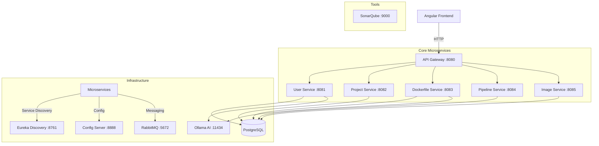

# DockerGen AI / DockerCraft 🚀

Plateforme moderne de génération de Dockerfiles et de gestion de pipelines CI/CD alimentée par l'Intelligence Artificielle (Ollama).

## 🏗️ Architecture du Système



## 🛠️ Microservices & Technologies

| Service | Description | Port |
| :--- | :--- | :--- |
| **Config Server** | Centralisation des fichiers de configuration (Git repo). | 8888 |
| **Discovery** | Service Discovery via Netflix Eureka. | 8761 |
| **Gateway** | Point d'entrée unique, routage et sécurité. | 8080 |
| **User Service** | Authentification, gestion des rôles et vérification étudiant (IA). | 8081 |
| **Project Service** | Gestion des projets de déploiement des utilisateurs. | 8082 |
| **Dockerfile Service** | Génération de Dockerfiles optimisés via LLM. | 8083 |
| **Pipeline Service** | Orchestration des builds et déploiements. | 8084 |
| **Image Service** | Gestion et stockage des métadonnées d'images Docker. | 8085 |

### Stack Technique
- **Backend :** Java 17, Spring Boot 3.4, Spring Cloud, Spring Data JPA.
- **Frontend :** Angular 19, RxJS, WebSocket (STOMP).
- **Base de données :** PostgreSQL.
- **Messaging :** RabbitMQ (Events distributed).
- **IA :** Ollama (Llama/Mistral models).
- **Qualité :** SonarQube.

## 🚀 Lancement Rapide

### Prérequis
- Docker & Docker Compose
- Java 17+ (pour le développement local)
- Node.js & Angular CLI (pour le frontend)

### Installation
1.  **Cloner le projet**
2.  **Lancer l'infrastructure complète :**
    ```bash
    cd microservice
    docker-compose up -d
    ```
3.  **Lancer le Frontend :**
    ```bash
    cd frontend-platform
    npm install
    npm start
    ```

## 🔒 Sécurité
- Authentification basée sur les **JWT (JSON Web Tokens)**.
- Chaque service valide le token via un filtre de sécurité partagé (en cours de centralisation).
- Rôles supportés : `STUDENT`, `PROFESSIONAL`, `ADMIN`.

## 📈 Monitoring (À venir)
- [ ] Integration de Prometheus & Grafana.
- [ ] Tracing distribué avec Micrometer & Zipkin.

---
*Maintenu par malekkhmiri-group.*
